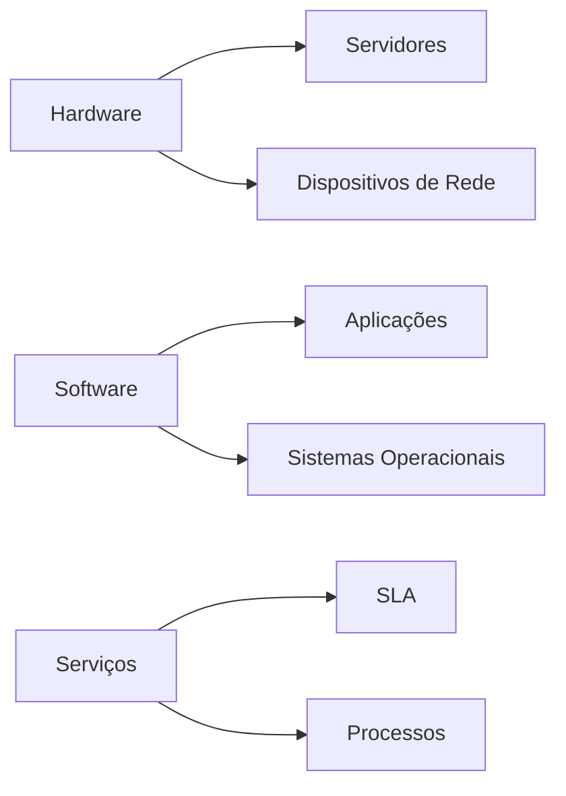
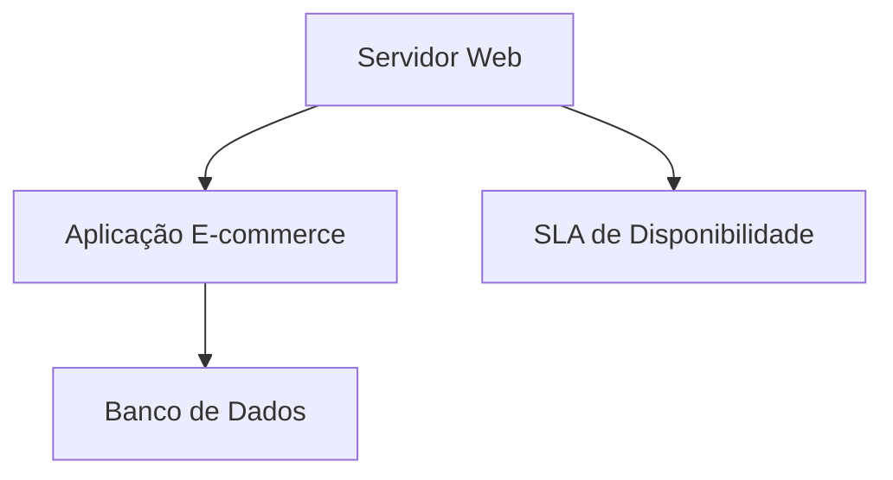

# Configuration Management Database (CMDB) - Guia Completo

## Visão Geral
A **Configuration Management Database (CMDB)** é um repositório centralizado que armazena informações sobre todos os Itens de Configuração (CIs) de uma organização e seus relacionamentos. É componente fundamental para:

- Gestão de Serviços de TI (ITSM)
- Governança de TI
- Conformidade e auditoria
- Gerenciamento de mudanças e incidentes

## Componentes Principais

### Itens de Configuração (CIs)
Elementos fundamentais gerenciados na CMDB:

### Atributos dos CIs
- **Identificação**: Nome, ID, tipo
- **Características**: Versão, localização, proprietário
- **Status**: Em produção, em manutenção, desativado
- **Relacionamentos**: Dependências, conexões

## Benefícios

✅ **Visibilidade completa** do ambiente de TI  
✅ **Análise de impacto** mais precisa  
✅ **Otimização de recursos** e custos  
✅ **Conformidade** com regulamentações  
✅ **Tomada de decisão** baseada em dados  

## Implementação Prática

### Melhores Práticas
1. **Comece pequeno**: Foque em CIs críticos primeiro
2. **Automatize coleta de dados**: Use ferramentas de discovery
3. **Defina responsáveis**: Atribua donos para cada CI
4. **Mantenha atualizado**: Estabeleça processos de revisão

### Ferramentas Populares
| Ferramenta    | Tipo        | Destaque                     |
|--------------|------------|-----------------------------|
| ServiceNow   | Cloud      | Integração com ITSM         |
| BMC Helix    | Enterprise | IA para análise             |
| IBM Maximo   | On-premise | Foco em ativos              |
| iTop         | Open-source| Customizável               |

## Caso de Uso Exemplo

**Problema**: Atualização de servidor web  
**Uso da CMDB**:
1. Identificar aplicações dependentes
2. Verificar janela de manutenção no SLA
3. Notificar times impactados
4. Documentar mudança

## Desafios Comuns

⚠️ **Dados desatualizados**  
⚠️ **Complexidade de relacionamentos**  
⚠️ **Resistência cultural** à adoção  
⚠️ **Falta de processos** claros  

## Conclusão

A CMDB é essencial para organizações que buscam:
- Melhorar **disponibilidade** de serviços
- Reduzir **tempo de resolução** de incidentes
- Otimizar **investimentos em TI**
- Garantir **conformidade** regulatória

> **Dica**: Implemente gradualmente e alinhe sempre com as necessidades do negócio.

---

**Como usar este documento:**
1. Copie todo o texto acima
2. Cole em um editor de texto simples (como Bloco de Notas)
3. Salve como `CMDB_Guide.md` (certifique-se de usar a extensão .md)
4. Para visualização ideal, use:
   - Editores como VS Code com extensão Markdown
   - Plataformas como GitHub ou GitLab
   - Visualizadores dedicados como Typora

**Observação sobre diagramas Mermaid:**
Os diagramas serão renderizados corretamente em plataformas que suportam Mermaid.js, como:
- GitHub/GitLab
- VS Code com extensão Mermaid
- Editores online como Mermaid Live Editor
